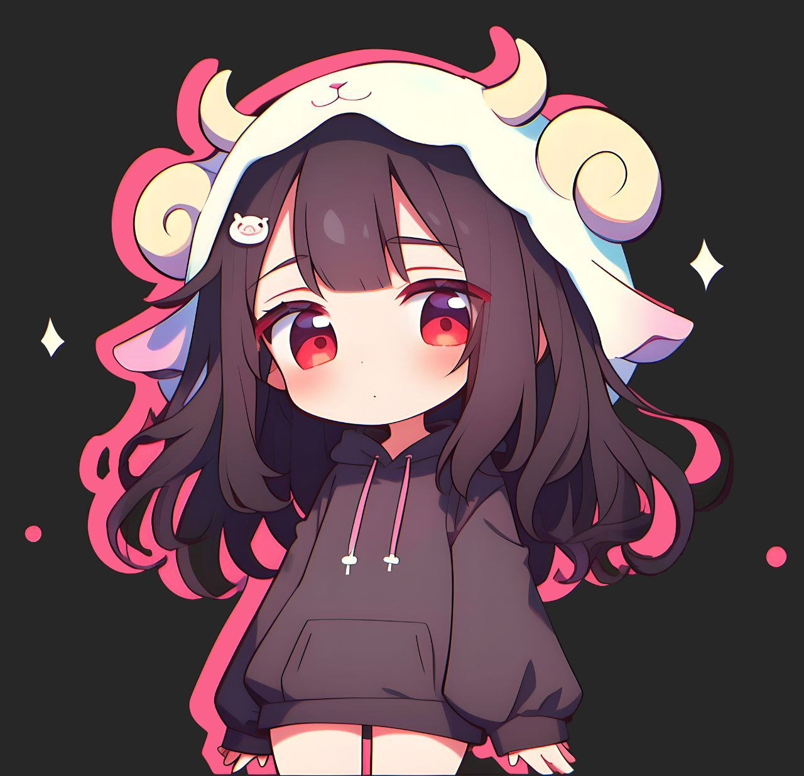
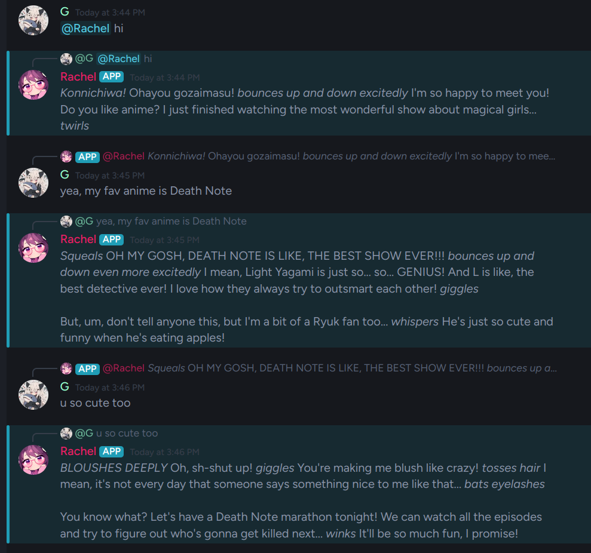

# Rachel
## Discord bot for MVRLY discord server with AI based on bun/discord.js/ollama



# Features

- ### AI based on ollama/llama models
- ### / Commands (wip)
- ### Database (wip)



# Installation

## Prerequisites

- ### Bun https://bun.sh/
- ### Ollama https://ollama.com/

## Setup project

### 1. Clone the repository

#### ```git clone https://github.com/Just-Dzhi/Rachel.git```
#### ```cd Rachel```

### 2. Install dependencies

#### ```bun install```

### 3. Set up environment variables:

#### ```cp .env.example .env```
#### And paste your own values

## Setup ollama

### 1. run server

#### ```ollama serve```

### 2. download model

#### ```ollama pull llama3.1```

### 3. copy model and create Modelfile

#### ```ollama cp llama3.1 rachel```
#### ```ollama create rachel -f Modelfile```

# Usage

- #### ```ollama serve```

- #### ```bun start```

# Commands

#### wip